<div align="center">

# 💊 MedTrack — Medication Management App

### *Never miss a dose. Stay connected with your care team.*

[](https://reactnative.dev/)
[](https://developer.android.com/)
[](https://developer.apple.com/)
[](LICENSE)

</div>

---

## 📱 Overview

**MedTrack** is a full-featured cross-platform medication management application built with **React Native**. It connects **Patients**, **Doctors**, and **Caregivers** in a unified ecosystem — enabling real-time medication tracking, adherence monitoring, prescription management, and medical report sharing.

> 🎯 Built to solve the real-world problem of medication non-adherence, which affects millions of patients globally.

---

## ✨ Key Features

| Feature | Description |
|---|---|
| 🔐 **Role-Based Auth** | Separate flows for Doctor, Patient & Caregiver |
| 💊 **Medicine Scheduling** | Add medications with custom daily times, meal timing & date ranges |
| ✅ **Dose Confirmation** | Mark doses as taken with photo proof |
| 📊 **Adherence Calendar** | Visual calendar showing Taken / Missed / Pending history |
| 📦 **Stock Tracking** | Real-time pill stock with days-remaining countdown |
| 🔔 **Notifications** | Smart reminders for upcoming doses |
| 🩺 **Doctor Dashboard** | Manage patient prescriptions and view medical reports |
| 👨‍👩‍👦 **Caregiver View** | Monitor assigned patients' adherence and logs |
| 📄 **Medical Reports** | Upload, view, edit and delete lab reports per patient |

---

## 🖼️ App Screenshots

### 🔐 Authentication

<div align="center">
<table>
  <tr>
    <td align="center"><b>Create Account</b></td>
    <td align="center"><b>Sign In</b></td>
  </tr>
  <tr>
    <td>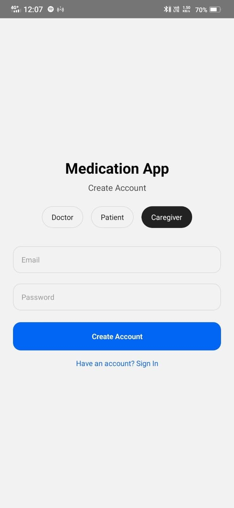</td>
    <td>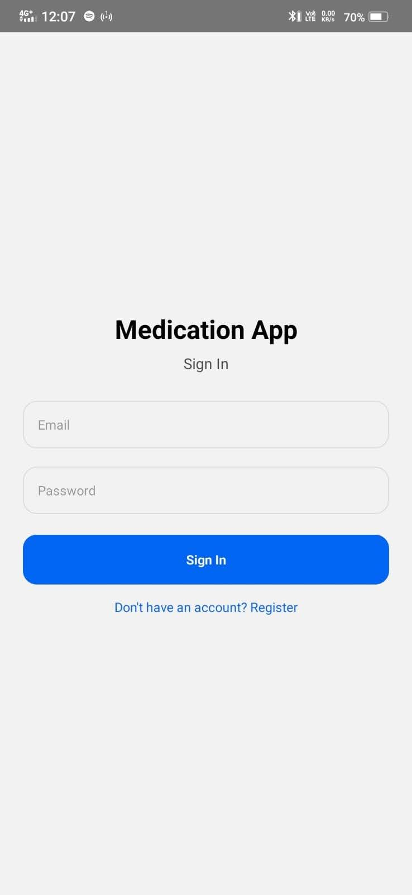</td>
  </tr>
</table>
</div>

> Role selection (Doctor / Patient / Caregiver) during registration routes users to their dedicated experience.

---

### 🧑‍⚕️ Patient Screens

<div align="center">
<table>
  <tr>
    <td align="center"><b>Home Dashboard</b></td>
    <td align="center"><b>Medicine Stocks</b></td>
    <td align="center"><b>Medicine Schedule</b></td>
  </tr>
  <tr>
    <td>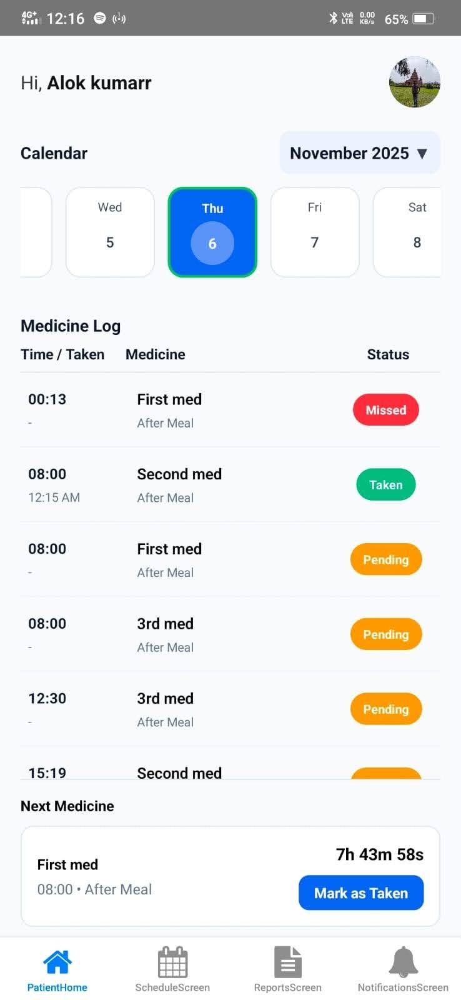</td>
    <td>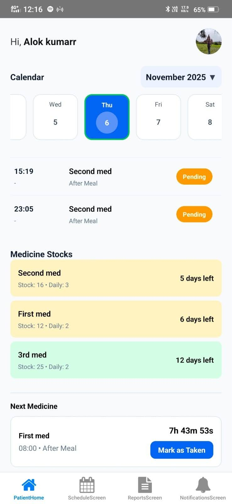</td>
    <td>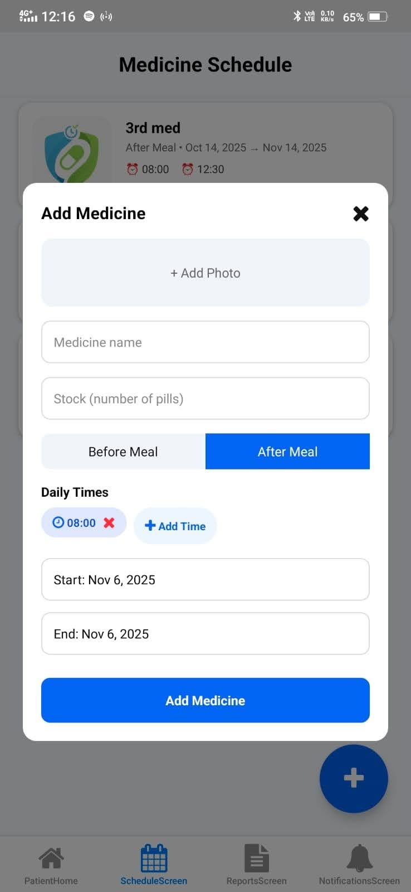</td>
  </tr>
</table>
</div>

<div align="center">
<table>
  <tr>
    <td align="center"><b>Confirm Dose Modal</b></td>
    <td align="center"><b>Add Medicine Modal</b></td>
    <td align="center"><b>My Profile</b></td>
  </tr>
  <tr>
    <td>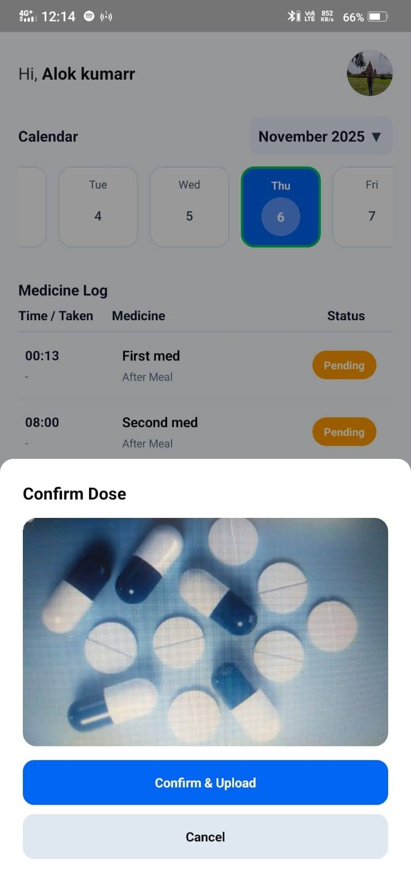</td>
    <td>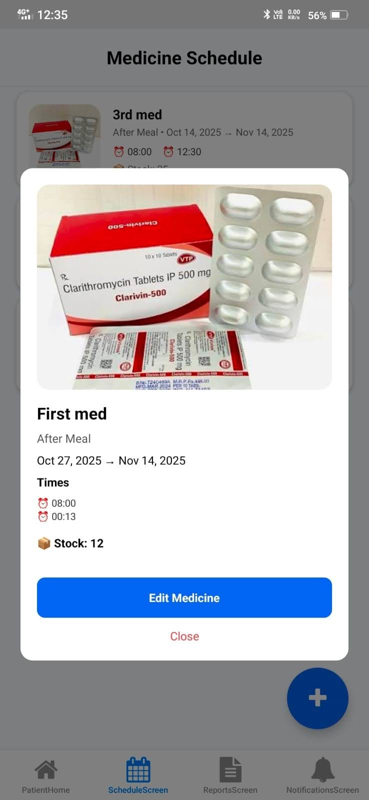</td>
    <td>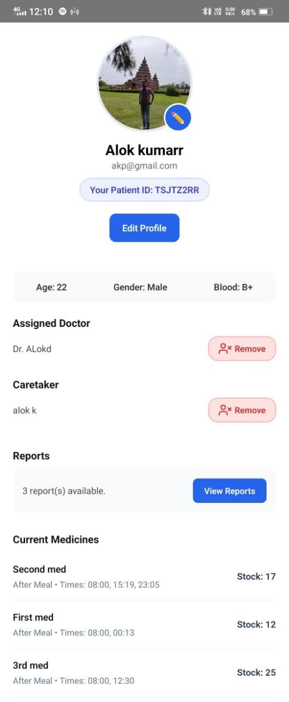</td>
  </tr>
</table>
</div>

---

### 👨‍⚕️ Doctor Screens

<div align="center">
<table>
  <tr>
    <td align="center"><b>Doctor Home</b></td>
    <td align="center"><b>Doctor Profile</b></td>
    <td align="center"><b>Manage Schedule</b></td>
    <td align="center"><b>Patient Reports</b></td>
  </tr>
  <tr>
    <td>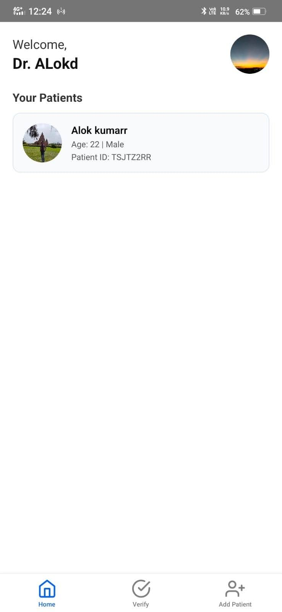</td>
    <td>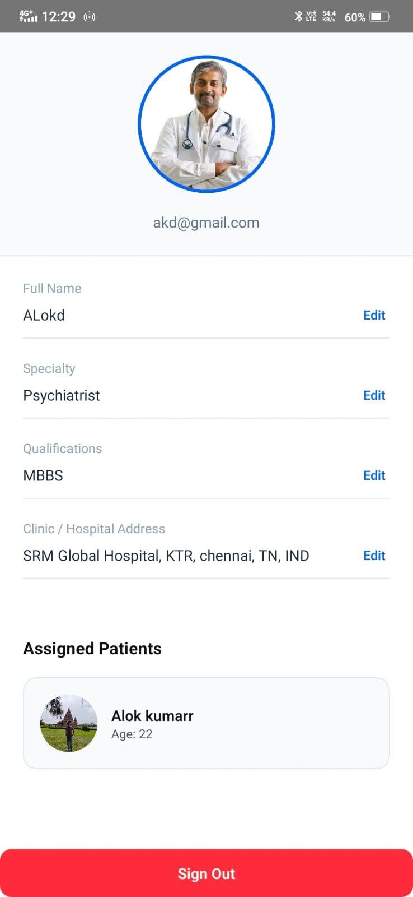</td>
    <td></td>
    <td></td>
  </tr>
</table>
</div>

---

### 🧑‍🤝‍🧑 Caregiver Screens

<div align="center">
<table>
  <tr>
    <td align="center"><b>Caregiver Home</b></td>
    <td align="center"><b>Patient Search</b></td>
    <td align="center"><b>Adherence View</b></td>
  </tr>
  <tr>
    <td>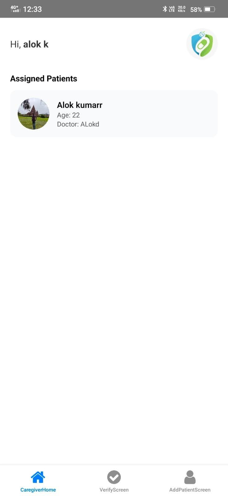</td>
    <td>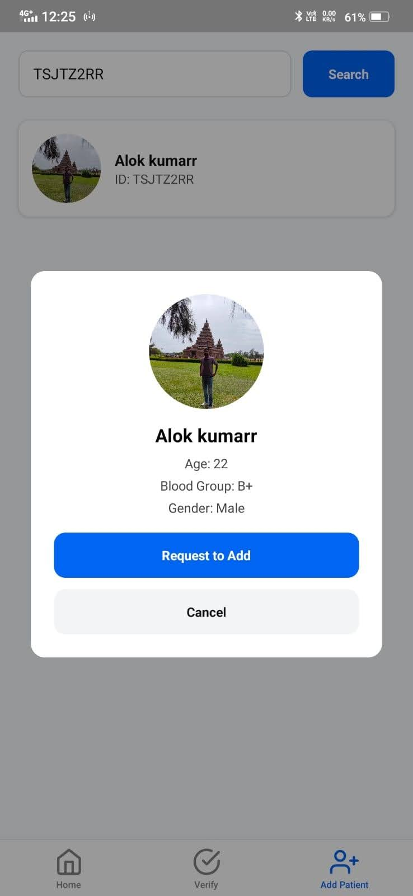</td>
    <td>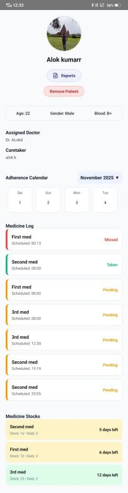</td>
  </tr>
</table>
</div>

---

## 🏗️ Architecture & User Roles

```
MedTrack App
│
├── 🔐 Auth Flow (Shared)
│   ├── Create Account (Role Selection)
│   └── Sign In
│
├── 🧑‍⚕️ Patient
│   ├── Home Dashboard (Medicine Log + Next Dose Timer)
│   ├── Medicine Schedule (Add / View / Edit Meds)
│   ├── Reports Screen
│   ├── Notifications
│   └── Profile (Patient ID, Doctor, Caregiver, Stocks)
│
├── 👨‍⚕️ Doctor
│   ├── Patient List
│   ├── Patient Detail (Schedule Tab + Reports Tab)
│   ├── Upload Medical Reports
│   └── Doctor Profile
│
└── 🧑‍🤝‍🧑 Caregiver
    ├── Assigned Patients List
    ├── Add Patient (by Patient ID)
    ├── Patient Adherence View
    └── Caregiver Profile
```

---

## 🚀 Getting Started

### Prerequisites

- Node.js >= 18
- React Native CLI
- Android Studio / Xcode
- JDK 17+

### Installation

```bash
# Clone the repository
git clone https://github.com/YOUR_USERNAME/medtrack-app.git
cd medtrack-app

# Install dependencies
npm install

# For iOS only
bundle install
bundle exec pod install
```

### Running the App

```bash
# Start Metro bundler
npm start

# Run on Android
npm run android

# Run on iOS
npm run ios
```

---

## 📂 Project Structure

```
medtrack-app/
├── src/
│   ├── screens/
│   │   ├── auth/          # Login & Register
│   │   ├── patient/       # Patient screens
│   │   ├── doctor/        # Doctor screens
│   │   └── caregiver/     # Caregiver screens
│   ├── components/        # Reusable UI components
│   ├── navigation/        # React Navigation setup
│   ├── services/          # API & Firebase services
│   └── utils/             # Helper functions
├── android/
├── ios/
└── README.md
```

---

## 🛠️ Tech Stack

- **Framework:** React Native (CLI)
- **Navigation:** React Navigation
- **State Management:** Context API / Redux
- **Backend:** Firebase / Supabase
- **Notifications:** Firebase Cloud Messaging
- **Storage:** AsyncStorage

---

## 🤝 Contributing

Contributions are welcome! Please feel free to open issues or submit pull requests.

1. Fork the project
2. Create your feature branch (`git checkout -b feature/AmazingFeature`)
3. Commit your changes (`git commit -m 'Add AmazingFeature'`)
4. Push to the branch (`git push origin feature/AmazingFeature`)
5. Open a Pull Request

---

## 📄 License

Distributed under the MIT License. See `LICENSE` for more information.

---

<div align="center">

Made with ❤️ using React Native

⭐ **Star this repo if you found it helpful!** ⭐

</div>
